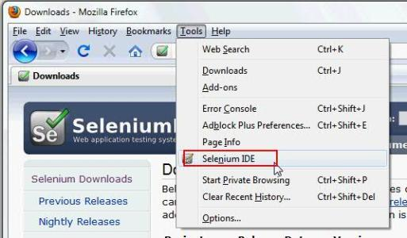

# Demo2


## 链接

### 内嵌式链接

- 外部链接：[百度](https://www.baidu.com)
- 内部链接1；链接仓库的其他文件：[demo1](demo1.md)
- 内部链接2：链接本文档的其他部分：[代码块 demo](demo2.md#代码块-demo)

### 引用式链接

- 外部链接：[百度]
- 外部链接：[百度][baidu]
- 内部链接1；链接仓库的其他文件：[demo1]
- 内部链接2：链接本文档的其他部分：[代码块 demo]


## 图片

- 图片的 MarkDown 语法：  
         
- 外部图片 demo

- 仓库内的图片 demo


图片的引用式链接：

-外部图片 demo
![baidu][baidu_logo]
- 仓库内的图片 demo
![][open_jpg]

## 引用

> 这是一个引文。

出自《出处》

多重引用。

>>> 这是多重引文。

## 代码块 demo

- 行内代码

这个代码中用来声明变量 `var a = 10`，打印变量为 `console.log` 函数的调用。

- 块式代码

```javascript
var a = 10;
console.log(a);
```

下面很少用

    var a = 10;
    console.log(a);

<!--- 下面是本文档用到的链接 -->

[百度]: https://www.baidu.com
[baidu]: httpd://www.baidu.com
[demo1]: demo1.md
[代码块 demo]: demo2.md#代码块-demo

[open_jpg]: images/open.jpg
[baidu_logo]: https://ss3.bdstatic.com/70cFv8Sh_Q1YnxGkpoWK1HF6hhy/it/u=2312261118,3383206621&fm=26&gp=0.jpg
